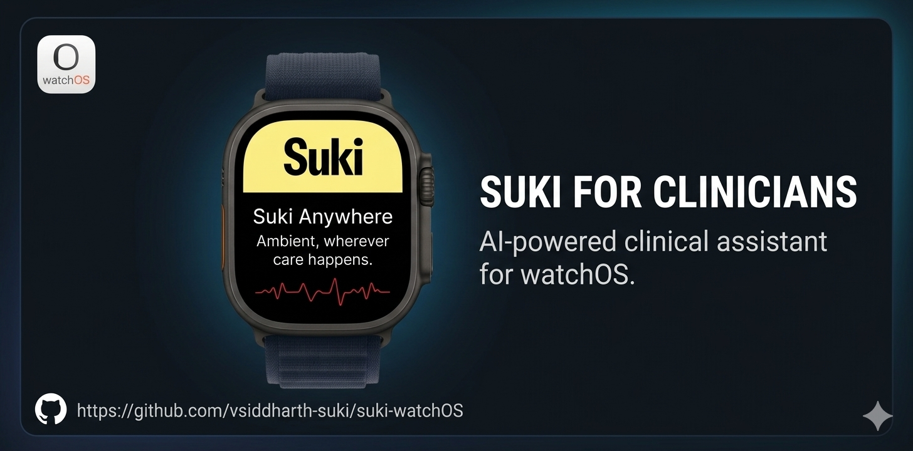

# Suki watchOS App

## Getting Started

### Prerequisites

Ensure the following are installed:

* **Xcode 26+**
* **watchOS 26+**

No separate dependency installation step is required. All package dependencies are already included in the repository.

### Clone the Repository

Clone the repository and switch to the default `main` branch:

```bash
git clone https://github.com/vsiddharth-suki/suki-watchOS.git
cd suki-watchOS
git checkout main
```

### Run the App

1. Open the project in **Xcode**.
2. Select a compatible **watchOS** simulator or an Apple Watch device.
3. Select the watchOS app target/scheme.
4. Build and run the app.

That's it — the project can be run directly after cloning the repository.
